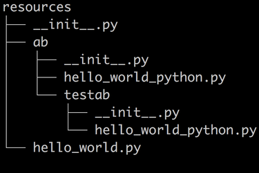

# PyAutoApiRoute
微服务时代，接口服务越来越细致，接口路由的管理会相对散乱，自动根据规则导入模块和映射路由就非常方便，也不再需要修改路由文件，减少风险。支持flask和tornado框架

路由管理规范：
     声明:
        此规范适用于 python Flask/Tornado/Sanic/Japronto框架

     所有仓库的API接口代码 均放在resources文件夹下，且此文件夹只能写接口API，路由会自动映射，不再需要修改入口文件增加路由信息，减少风险。
     此规则实行之前，以前已经产生的接口路由不会变，规范实行之后，统一使用如下规范编写接口文件。
     
     规则举例如下：
        如下图，resources下有一个hello_world接口，还有一个ab项目文件夹，ab下面还有一个hello_world_python接口以及子项目文件夹testab, testab      下面也有一个hello_world_python.

                                            
      
      1.接口文件的文件名命名规范：
          文件名命名均为小写，多个word之间使用'_'隔开，比如hello_world.py 命名正确，helloWorld.py命名错误。

      2.接口文件里的接口类Class命名是以文件名字转为驼峰格式，且首字母大写。比如hello_world.py 对应的接口类是 HelloWorld
          举例： hello_world.py

                  
                hello_world_python.py

                  
                  

      3.路由入口文件会自动映射，映射规则为:
          前缀 / 项目文件夹[...] / 文件名
              其中 前缀为整个仓库的前缀，可以各自定义，也可以不定义，比如iap-api仓库，可以定义整个仓库的路由前缀为 iap/
                  项目文件夹如果有，则会自动拼接，如果没有，则不会读取。
          举例：
             前缀为空，上图resources中的三个接口对应的路由为：
                 hello_world.py ==>  /hello_world
                 ab/hello_world_python.py ==> /ab/hello_world_python
                 ab/testab/hello_world_python.py ==> /ab/testab/hello_world_python
 
             前缀为tornado/，上图resources中的三个接口对应的路由为：
                 hello_world.py ==> tornado/hello_world
                 ab/hello_world_python.py ==> tornado/ab/hello_world_python
                 ab/testab/hello_world_python.py ==> tornado/ab/testab/hello_world_python

      4.关于项目目录结构，代码里可以允许N层，但建议不要超过3层, 不易管理。
     

